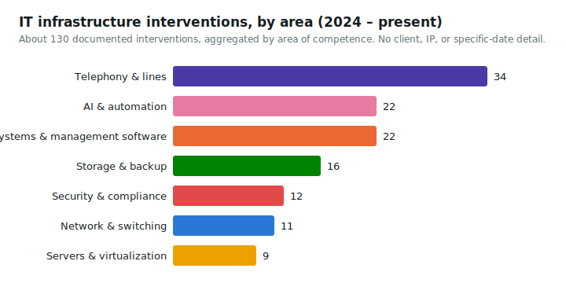

# Corporate network design and documentation

**Sector**: language services and professional translation company

**Period**: 06/2026 - ongoing

**Role**: IT Manager, network administrator

**Technologies**: Proxmox VE, PowerShell, REST API for infrastructure snapshots, technical
documentation aligned with ISO/IEC 27001

## Context

The history of interventions on the corporate network (topology, firewall, virtualization) had no
centralized, reconstructible documentation: every intervention risked depending on the memory of
whoever carried it out, with no reliable current snapshot of the infrastructure state to build on.

## What was built

A network documentation and design repository with a two-layer structure: a narrative layer for
the operational log and extended context, and a versioned technical layer with structured
records, a chronological timeline of interventions, and documentation of the firewall and other
components, with an approach oriented toward ISO/IEC 27001 compliance for the network security
part. A PowerShell script queries the REST API of the Proxmox VE hypervisor and automatically
produces a complete snapshot of the current state of the virtualized infrastructure, so the
technical document stays aligned with reality instead of drifting out of date over time. The
infrastructure's real IP addresses are kept out of the versioned repository.

*Aggregate count by area of competence, with no detail on client, IP address, or the specific
date of individual interventions.*

## Result

A single, updatable source of truth for the state of the network, which reduces dependence on the
tacit knowledge of whoever carried out individual interventions and speeds up both security
audits and onboarding onto a new intervention.
