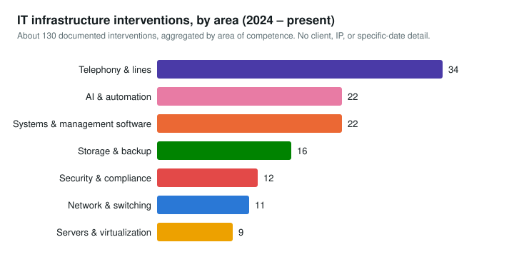

# Corporate network design and documentation

**Sector**: language services and professional translation company

**Period**: 10/2024 - ongoing

**Role**: IT Manager, network administrator

**Technologies**: Proxmox VE, PowerShell, Python, Proxmox REST API for infrastructure snapshots, JSON topology as the source of truth with a generated HTML map, technical documentation aligned with ISO/IEC 27001

## Context

The history of interventions on the corporate network (topology, firewall, virtualization) had no centralized, reconstructible documentation: every intervention risked depending on the memory of whoever carried it out, with no reliable current snapshot of the infrastructure state to build on.

## What was built

A network documentation and design repository with a two-layer structure: a narrative layer for the operational log and extended context, and a versioned technical layer with structured records, a chronological timeline of interventions, and documentation of the firewall and other components, with an approach oriented toward ISO/IEC 27001 compliance for the network security part. A PowerShell script queries the REST API of the Proxmox VE hypervisor and produces a snapshot of the state of the virtualized infrastructure; a second script compares the documented topology with the snapshots and reports the differences. The infrastructure's real IP addresses are kept out of the versioned repository.

The project grew from documentation alone into a structural network intervention: segmentation into VLANs dedicated by device class, an audit of the physical and electrical layer (power, continuity, cabling), a security perimeter hardening campaign, migration of corporate telephony to a cloud system, and an interactive network map generated from the structured source of truth instead of maintained by hand. In 2026 the work also included an investigation into virtual machine backups, carried out through successive measurements, which ruled out the server and located the bottleneck in the network storage.

*Aggregate count by area of competence, with no detail on client, IP address, or the specific date of individual interventions.*

## Result

A single source of truth for the state of the network, verifiable against the real infrastructure, which reduces dependence on the memory of whoever carried out individual interventions.
