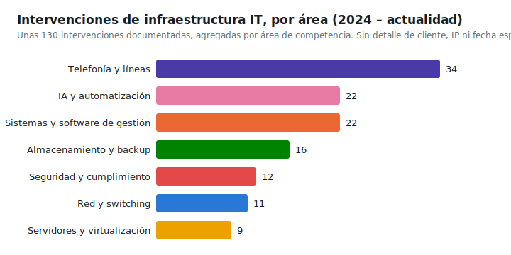

# Diseño y documentación de la red corporativa

**Sector**: empresa de servicios lingüísticos y traducción profesional

**Periodo**: 06/2026 - en curso

**Rol**: IT Manager, administrador de red

**Tecnologías**: Proxmox VE, PowerShell, API REST para snapshots de infraestructura,
documentación técnica alineada con ISO/IEC 27001

## Contexto

El historial de intervenciones sobre la red corporativa (topología, firewall, virtualización) no
contaba con documentación centralizada y reconstruible: cada intervención corría el riesgo de
depender de la memoria de quien la había ejecutado, sin un snapshot actual fiable del estado de
la infraestructura del que partir.

## Qué se hizo

Repositorio de documentación y diseño de la red con doble capa: una narrativa para el diario
operativo y el contexto extendido, y una técnica versionada con fichas estructuradas, la
cronología de las intervenciones y la documentación del firewall y demás componentes, con un
enfoque orientado al cumplimiento de ISO/IEC 27001 para la parte de seguridad de red. Un script
de PowerShell consulta la API REST del hipervisor Proxmox VE y produce automáticamente un
snapshot completo del estado actual de la infraestructura virtualizada, de modo que el documento
técnico se mantenga siempre alineado con la realidad en lugar de desactualizarse con el tiempo.
Las direcciones IP reales de la infraestructura quedan fuera del repositorio versionado.

*Recuento agregado por área de competencia, sin ningún detalle sobre cliente, IP o fecha
específica de las intervenciones individuales.*

## Resultado

Una fuente de verdad única y actualizable para el estado de la red, que reduce la dependencia del
conocimiento tácito de quien ejecutó cada intervención y agiliza tanto las auditorías de
seguridad como la incorporación a una intervención nueva.
