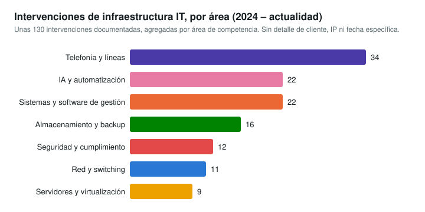

# Diseño y documentación de la red corporativa

**Sector**: empresa de servicios lingüísticos y traducción profesional

**Periodo**: 10/2024 - en curso

**Rol**: IT Manager, administrador de red

**Tecnologías**: Proxmox VE, PowerShell, Python, API REST de Proxmox para los snapshots de la infraestructura, topología en JSON como fuente de verdad con un mapa HTML generado, documentación técnica alineada con ISO/IEC 27001

## Contexto

El historial de intervenciones sobre la red corporativa (topología, firewall, virtualización) no contaba con documentación centralizada y reconstruible: cada intervención corría el riesgo de depender de la memoria de quien la había ejecutado, sin un snapshot actual fiable del estado de la infraestructura del que partir.

## Qué se hizo

Repositorio de documentación y diseño de la red con doble capa: una narrativa para el diario operativo y el contexto extendido, y una técnica versionada con fichas estructuradas, la cronología de las intervenciones y la documentación del firewall y demás componentes, con un enfoque orientado al cumplimiento de ISO/IEC 27001 para la parte de seguridad de red. Un script de PowerShell consulta la API REST del hipervisor Proxmox VE y produce un snapshot del estado de la infraestructura virtualizada; un segundo script compara la topología documentada con los snapshots y señala las diferencias. Las direcciones IP reales de la infraestructura quedan fuera del repositorio versionado.

El proyecto pasó de la sola documentación a una intervención estructural sobre la red: segmentación en VLAN dedicadas por clase de dispositivo, una auditoría de la capa física y eléctrica (alimentación, continuidad, cableado), una campaña de hardening del perímetro de seguridad, la migración de la telefonía corporativa a un sistema en la nube, y un mapa de red interactivo generado a partir de la fuente de verdad estructurada en lugar de mantenido a mano. En 2026 el trabajo incluyó también una investigación sobre las copias de seguridad de las máquinas virtuales, realizada mediante mediciones sucesivas, que descartó el servidor y localizó el cuello de botella en el almacenamiento de red.

*Recuento agregado por área de competencia, sin ningún detalle sobre cliente, IP o fecha específica de las intervenciones individuales.*

## Resultado

Una fuente de verdad única para el estado de la red, verificable frente a la infraestructura real, que reduce la dependencia de la memoria de quien ejecutó cada intervención.
