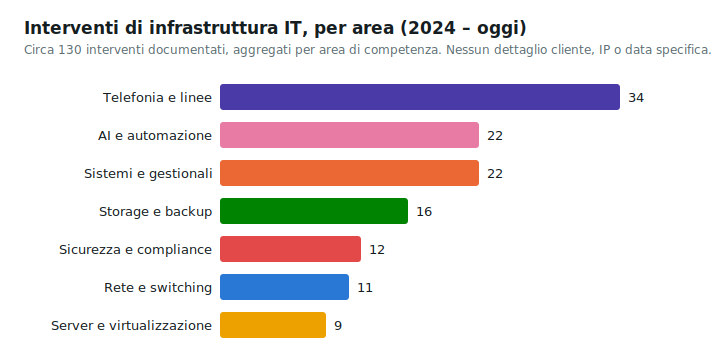

# Progettazione e documentazione della rete aziendale

**Settore**: azienda di servizi linguistici e traduzione professionale

**Periodo**: 06/2026 - in corso

**Ruolo**: IT Manager, sistemista di rete

**Tecnologie**: Proxmox VE, PowerShell, API REST per lo snapshot di infrastruttura, documentazione
tecnica allineata a ISO/IEC 27001

## Contesto

La storia degli interventi sulla rete aziendale (topologia, firewall, virtualizzazione) non aveva
una documentazione centralizzata e ricostruibile: ogni intervento rischiava di dipendere dalla
memoria di chi lo aveva eseguito, senza uno snapshot corrente affidabile dello stato
dell'infrastruttura da cui ripartire.

## Cosa è stato fatto

Repository di documentazione e progettazione della rete con un doppio layer: uno narrativo per il
diario operativo e il contesto esteso, uno tecnico versionato con schede strutturate, la timeline
cronologica degli interventi e la documentazione del firewall e degli altri componenti, con un
taglio orientato alla conformità ISO/IEC 27001 per la parte di sicurezza di rete. Uno script
PowerShell interroga l'API REST dell'hypervisor Proxmox VE e produce automaticamente uno snapshot
completo dello stato corrente dell'infrastruttura virtualizzata, così che il documento tecnico
resti sempre allineato alla realtà invece di andare disallineato nel tempo. Gli indirizzi IP reali
dell'infrastruttura restano fuori dal repository versionato.

*Conteggio aggregato per area di competenza, senza alcun dettaglio su cliente, IP o data
specifica dei singoli interventi.*

## Risultato

Una fonte di verità unica e aggiornabile per lo stato della rete, che riduce la dipendenza dalla
conoscenza tacita di chi ha eseguito i singoli interventi e velocizza sia gli audit di sicurezza
sia l'onboarding su un intervento nuovo.
