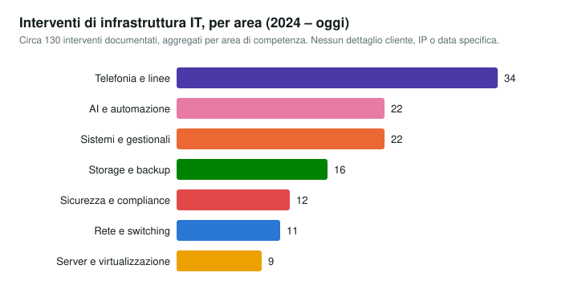

# Progettazione e documentazione della rete aziendale

**Settore**: azienda di servizi linguistici e traduzione professionale

**Periodo**: 10/2024 - in corso

**Ruolo**: IT Manager, sistemista di rete

**Tecnologie**: Proxmox VE, PowerShell, Python, API REST di Proxmox per lo snapshot dell'infrastruttura, topologia in JSON come fonte di verità con mappa HTML generata, documentazione tecnica allineata a ISO/IEC 27001

## Contesto

La storia degli interventi sulla rete aziendale (topologia, firewall, virtualizzazione) non aveva una documentazione centralizzata e ricostruibile: ogni intervento rischiava di dipendere dalla memoria di chi lo aveva eseguito, senza uno snapshot corrente affidabile dello stato dell'infrastruttura da cui ripartire.

## Cosa è stato fatto

Repository di documentazione e progettazione della rete con un doppio layer: uno narrativo per il diario operativo e il contesto esteso, uno tecnico versionato con schede strutturate, la timeline cronologica degli interventi e la documentazione del firewall e degli altri componenti, con un taglio orientato alla conformità ISO/IEC 27001 per la parte di sicurezza di rete. Uno script PowerShell interroga l'API REST dell'hypervisor Proxmox VE e produce uno snapshot dello stato dell'infrastruttura virtualizzata; un secondo script confronta la topologia documentata con gli snapshot e segnala le differenze. Gli indirizzi IP reali dell'infrastruttura restano fuori dal repository versionato.

Il progetto si è esteso dalla sola documentazione a un intervento strutturale sulla rete: segmentazione in VLAN dedicate per classe di dispositivo, un audit del livello fisico ed elettrico (alimentazione, continuità, cablaggio), una campagna di hardening sul perimetro di sicurezza, la migrazione della telefonia aziendale verso un sistema cloud, e una mappa di rete interattiva generata dalla fonte di verità strutturata invece che scritta a mano. Nel 2026 il lavoro ha incluso anche un'indagine sui backup delle macchine virtuali, condotta per misure successive, che ha escluso il server e individuato il collo di bottiglia nel deposito di rete.

*Conteggio aggregato per area di competenza, senza alcun dettaglio su cliente, IP o data specifica dei singoli interventi.*

## Risultato

Una fonte di verità unica per lo stato della rete, verificabile contro l'infrastruttura reale, che riduce la dipendenza dalla memoria di chi ha eseguito i singoli interventi.
